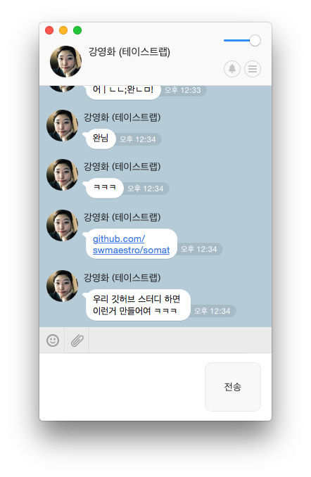
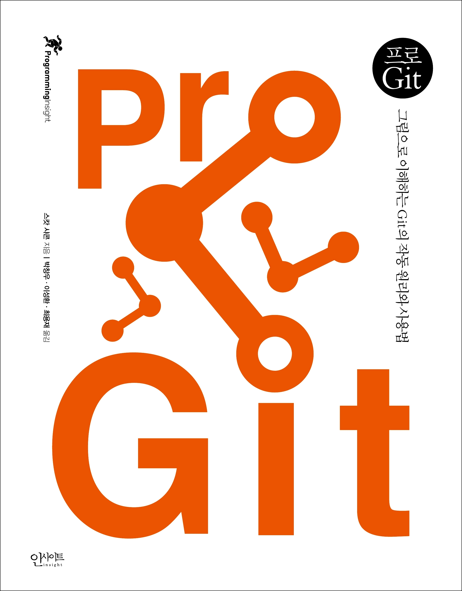
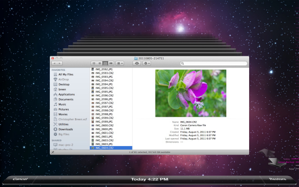
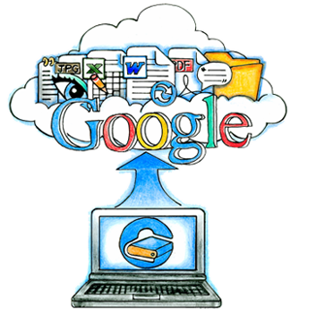
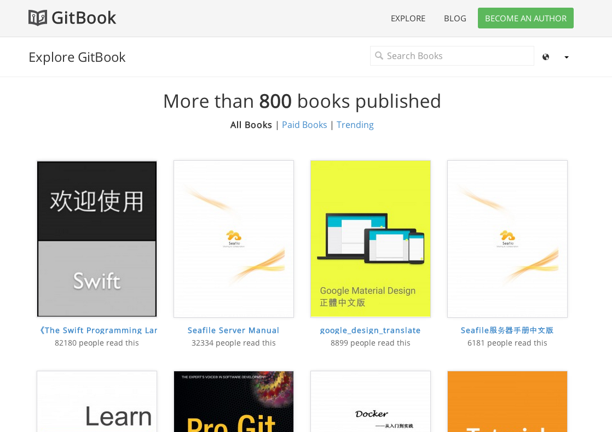
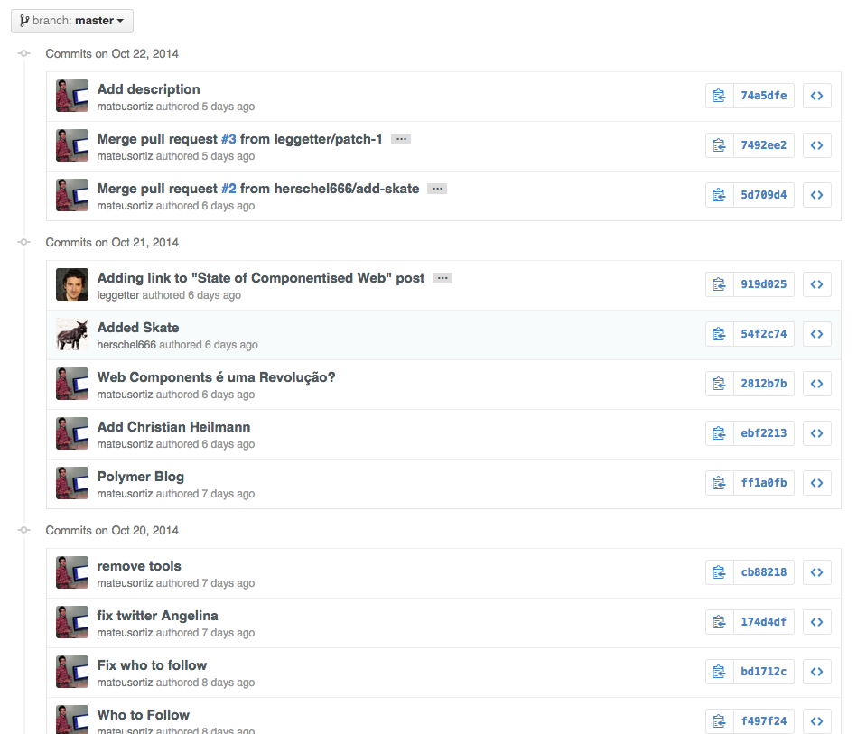
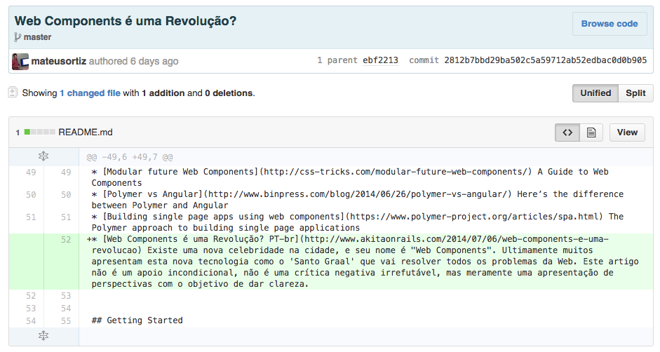
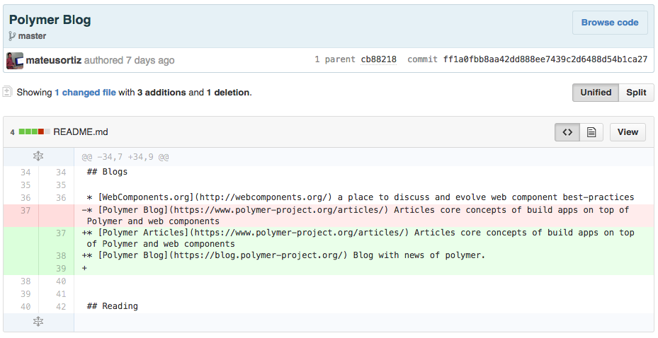

title : Git, Intro.
output : index.html
author:
	name : changwan jun
theme : sudodoki/reveal-cleaver-theme 
style : my.css

--

# Git
\#1 시작하기

--

## 발단

--

[https://github.com/swmaestro/somat](https://github.com/swmaestro/somat)

--

그걸 본 나의 기분

--

그리고 앞으로 가르칠 나의 모습

--

그렇지만 끝까지 **열심히**해봅시다.

--

## 교재

- 주교재 :  
[Github, GIT CHEAT SHEET
](https://training.github.com/kit/downloads/github-git-cheat-sheet.pdf)
- 부교재 :  
스캇 샤콘, 프로 Git, 박창우 외 공역, 인사이트, 2013

--

--

## 깃이란?

--

- 소스 코드 관리를 위한 분산 버전 관리 시스템.
- 리누즈 토발즈가 만들었고,
- SVN -> Mercurial -> Git 순으로 발전함.
- ~~근데 지금 여기서 하는 말은 하나도 필요없음.~~

--

클라우드의 증조할아버지 뻘 되는 녀석임.

--

맥OS 타임머신의 고조할아버지 뻘 되는 녀석임.

--

여러사람들이 하나의 문서 작성하는데 최적화 된 도구.
 
(구글독스도 같은 원리로 돌아감, 아마 현존하는 클라우드 문서 도구들은 전부 비슷한 원리로 돌아감.)

--

## 그걸 왜 쓰는데?

- 동시에 여러사람이 편집하기 좋음. 무슨일을 해도 데이터가 날아가지 않음.  
(완전무결성 개이득.)
- 이전에 데이터 날려도 언제든지 원하는 때로 복원 가능.
- 지금도 훌륭한 얼리어답터이지만 이른바 메가얼리어답터가 될 수 있음.
- 그리고 이 모든게 다 공짜!!!!!
- ~~그냥 멋있잖아..-~~

--

## 그래서 뭘 할 수 있을까?

--

책도 만들 수 있고..

--

PPT도 만들 수 있고..

--

이렇게 쓰는 사람도 있고..

- [집안일 관리하기](https://github.com/frabcus/house/issues) 
- [공용 문서 편찬](https://github.com/mateusortiz/webcomponents-the-right-way)

--

### 사실 이게 핵심임.

--

이 모든 것의 변화를 추적할 수 있음!

--

--

## 그래서 우린 뭐할건데?

- 예습은 없음, 복습만 해보세요.
- 그냥 앞에 나오는거 따라서 실습하는 시간으로 구성.

--

## 시간구성

- **1주차 : 환경구축(Github, Git, Sublime)**
- 2주차 : init, add, rm, commit, push
- 3주차 : clone, pull
- 4주차 : merge
