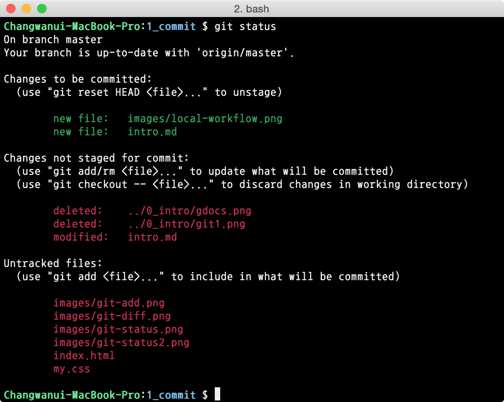
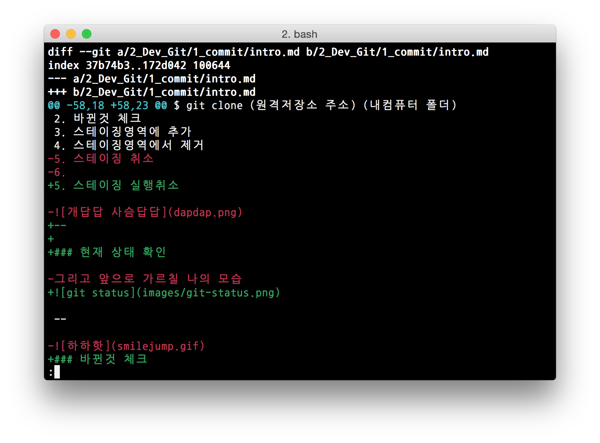

title : Git, Intro.
output : index.html
author:
	name : changwan jun
theme : sudodoki/reveal-cleaver-theme 
style : my.css

--

# Git
\#2 시작부터 서버에 올리기

--

## 깃의 흐름


--

기억해두세요,

1. 작업폴더
2. 스테이징영역
3. 깃저장소
4. (원격저장소)

--

## 시작하는 방법

--

1. 새로 생성하기
2. 기존 저장소를 가져와서 사용하기 (다음주에 합시다~)

--

### 새로 생성하기

사전에 github 저장소를 구해놓으면 좋음.

```bash
$ git init
$ git remote add origin (원격저장소 주소)
```

원격 저장소 없이도 사용할 수 있음. (내 컴퓨터에서만..)

--

## 스테이징 명령어

1. 현재 상태 확인
2. 바뀐것 체크
3. 스테이징영역에 추가
4. 스테이징영역에서 제거
5. 스테이징 실행취소
6. 저장소에 반영하기

--

## 1. 현재 상태 확인



--

## 2. 바뀐것 체크

```bash
$ git diff
```



--

## 2. 바뀐것 체크

사실 별로 안씀. (여러분은 Github를 응용)

--

## 3. 스테이징영역에 추가

다음 상태에서 사용할 수 있음.

- Untracked files
- Changes > mofied


--


```bash
$ git add 1_commit/intro.md
$ git add 1_commit/images/git_add.png
```

--

## 4. 스테이징영역에서 제거

다음 상태에서 사용할 수 있음.

- Changes > deleted

```bash
$ git rm 0_intro/ppt.png
```

--

## 5. 스테이징 실행취소

초록색으로 스테이징 영역에 있는 경우 사용할 수 있음.

```bash
$ git reset HEAD 1_commit/intro.md
```

--

## 6. 저장소에 반영하기

```bash
$ git commit
$ git commit -m "이거는 여기가 바뀌었어요!"
```

--

## 깃 저장소에반영하기

```bash
$ git push origin master
```

--

## 현재까지

- 1주차 : 환경구축(Github, Git, Sublime)
- **2주차 : init, add, rm, commit, push**
- 3주차 : clone, pull
- 4주차 : merge

--

## 저장소

- [github.com/tastelab-kr/study](https://github.com/tastelab-kr/study) 

