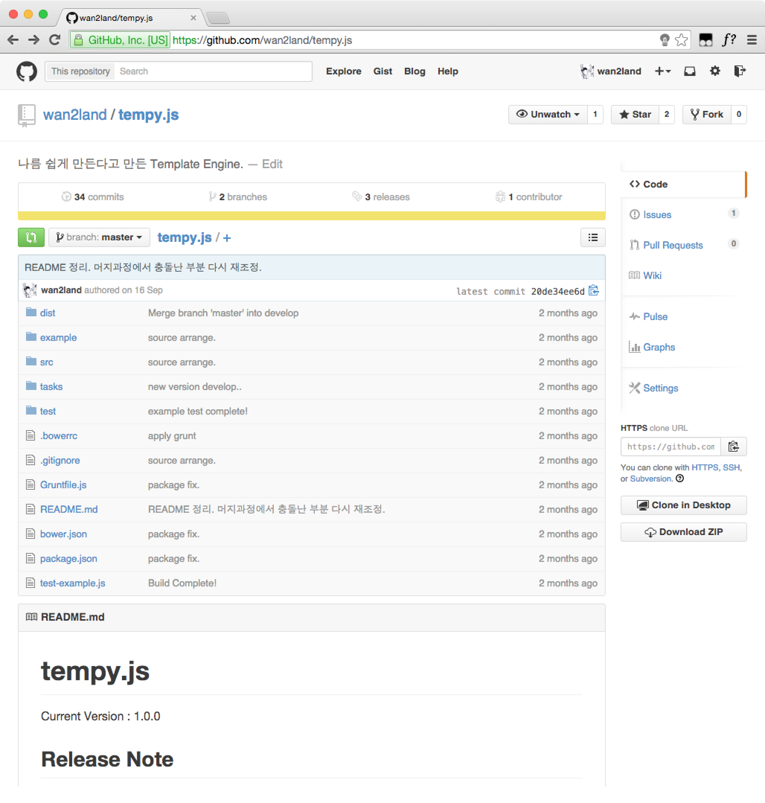
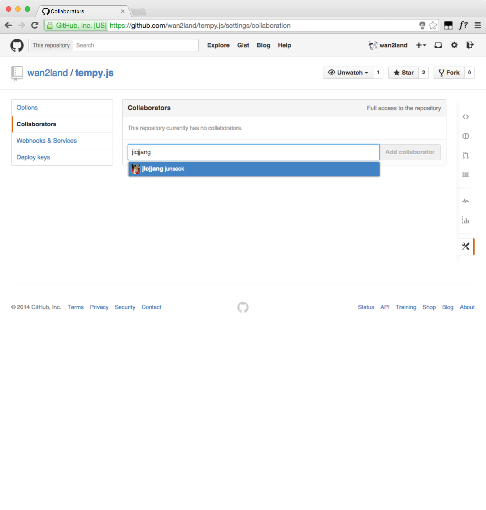

title : Git, Intro.
output : index.html
author:
	name : changwan jun
theme : sudodoki/reveal-cleaver-theme 
style : my.css

--

# Git
\#2 프로젝트 함께하기 (1)

--

## Github에 함께 할 친구를 추가

--

### Settings Click



--


### Collaborator에 추가



--

## 작업 흐름

--

### 내 컴퓨터에 소스가 "없"을 때

1. 저장소를 내 컴퓨터에 복사
2. 소스 수정
3. 소스 올리기

--

### 내 컴퓨터에 소스가 "있"을 때

1. 소스를 동기화
2. 소스 수정
3. 소스 올리기

--

### 저장소를 내 컴퓨터에 복사

```bash
$ git clone (원격저장소 주소) (내컴퓨터 폴더)
```

위 명령어에서 내 컴퓨터 폴더는 생략가능.

--

### 소스를 동기화

```bash
$ git pull origin master
```

--

### 주의사항

1. `git push` 직전에 반드시 `git pull`을 사용해야함.
2. `conflict`를 보더라도 당황하지 말자.  
(다음주 내용~)

--

## 전체 흐름을 다시 한번 정리

--

### 1. 새로 시작하기 (지난주)

1. `$ git init`
2. `$ git remote add origin {remote repository}`
3. `$ git add {filename}`
4. `$ git commit`
5. `$ git push origin master`

--

### 2. 내 컴퓨터에 소스가 없을 때

1. `$ git clone {remote repository} {directory}`
2. `$ git add {filename}`
3. `$ git commit`
4. `$ git push origin master`

--

### 3. 내 컴퓨터에 소스가 있을 때

1. `$ git pull origin master`
2. `$ git add {filename}`
3. `$ git commit`
4. `$ git push origin master`

--

## 그 외에 자주 쓰는 명령어
--

모든 파일을 추가할 때.

```bash
$ git add .
```

--

한번에 많은 파일을 삭제 할 때

```bash
$ git rm . -r --cached
$ git add .
```

--

## 현재까지

- 1주차 : 환경구축(Github, Git, Sublime)
- 2주차 : init, add, rm, commit, push
- **3주차 : clone, pull**
- 4주차 : merge

--

## 저장소

- [github.com/tastelab-kr/study](https://github.com/tastelab-kr/study) 

